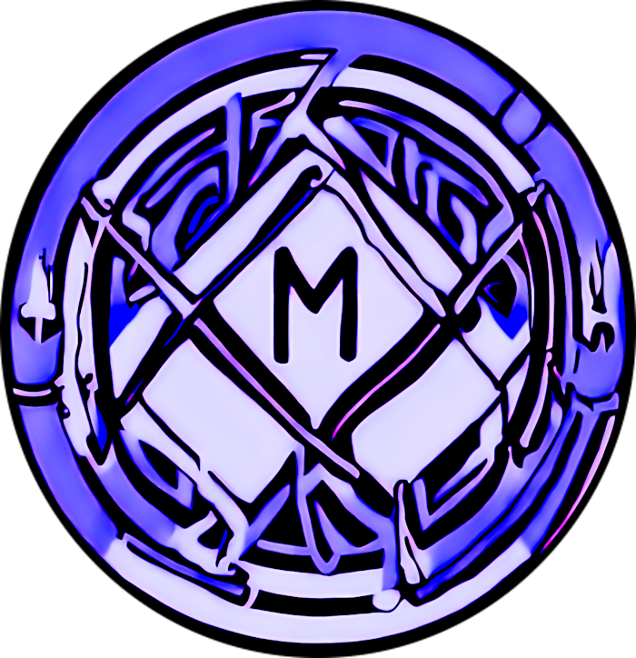

<p align="center">
  
</p>

<h1 align="center">MusePipe</h1>

<h3 align="center">Musepipe is mediapipe based on library.</h3>
<br>


[](https://results.pre-commit.ci/latest/github/onuralpszr/musepipe/main)

<p>
  
  
  
  
  
  
  
  
</p>

## ⚙️ Requirements ⚙️

* Python 3.8  Python3.10 (Virtualenv recommended)
* Optional: Poetry
* Optional: Nvidia CUDA for cuda usage

## 🛠️ Installation 🛠️

### Pip installation

```bash
python -m venv .venv
pip install -r requirements.txt
source .venv/bin/activate
```

### Poetry installation

```bash
poetry shell
poetry install
```

### Pre-commit .git/hook installation

* Prerequisites pip or poetry installation

```bash
pre-commit install -f --config .pre-commit-config.yaml
```

### Feature list
TBH
